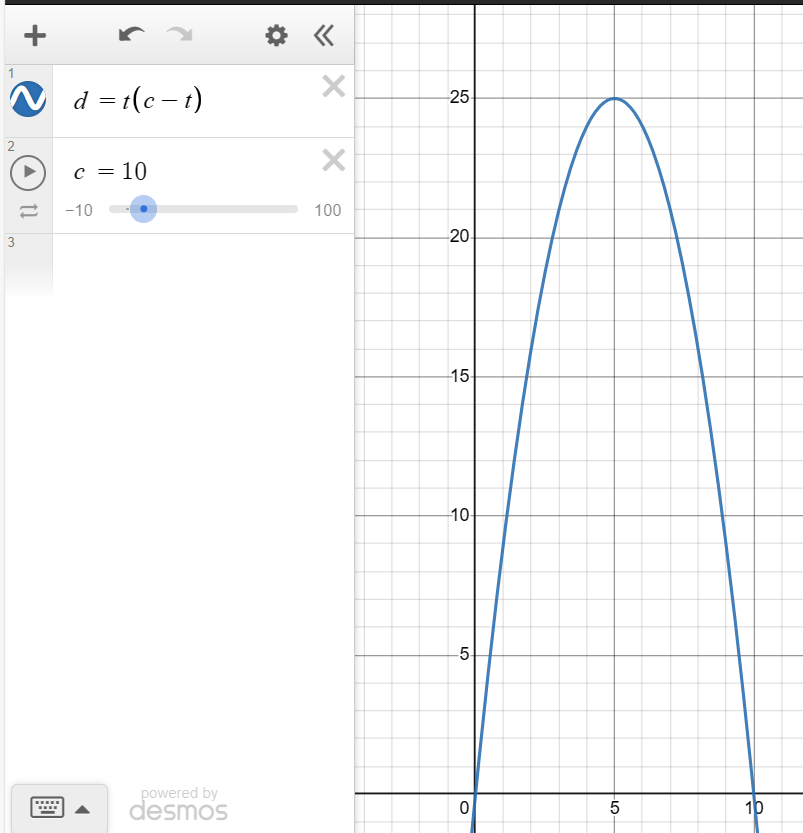

# Day 6: Wait For It

## Star 1

For each race, we can iterate through all the possible times we hold down the button, and manually compare their distance travelled to the record distance to count the number of possibilities where we win.

## Star 2

The problem is essentially the same as in Star 1, but we consider a single race with a huge number of possible times. While brute forcing could still provide the solution in a reasonable amount of time, we can take this opportunity to employ a more efficient solution.

We can note that the distance travelled $d$, given the amount of time we hold down the button for $t$, can be modeled as $d = t(c - t)$, where $c$ is a constant representing the total time of the race. This is the equation for a downward facing parabola, which we can confirm using a graphing calculator:

<small>**Graph generated using [Desmos Graphing Calculator](https://www.desmos.com/calculator)**</small>

Instead of manually counting the number of wins, we can count the number of loses up until we start to win. Then, given the symmetry of the graph, we can double this to obtain the total number of loses, and subtract it from our total number of possibilities to obtain the number of times we win.
